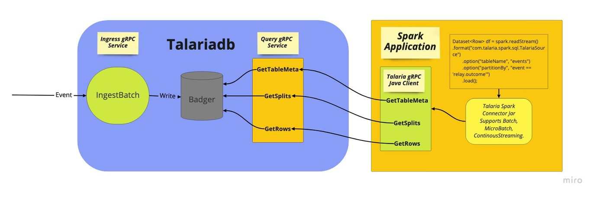
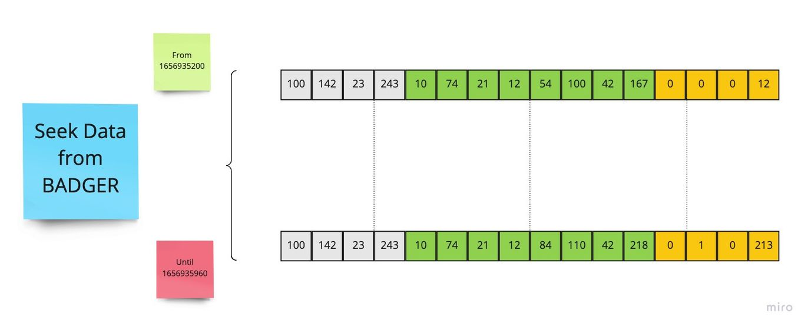
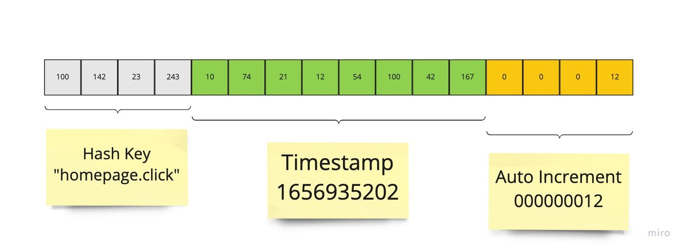
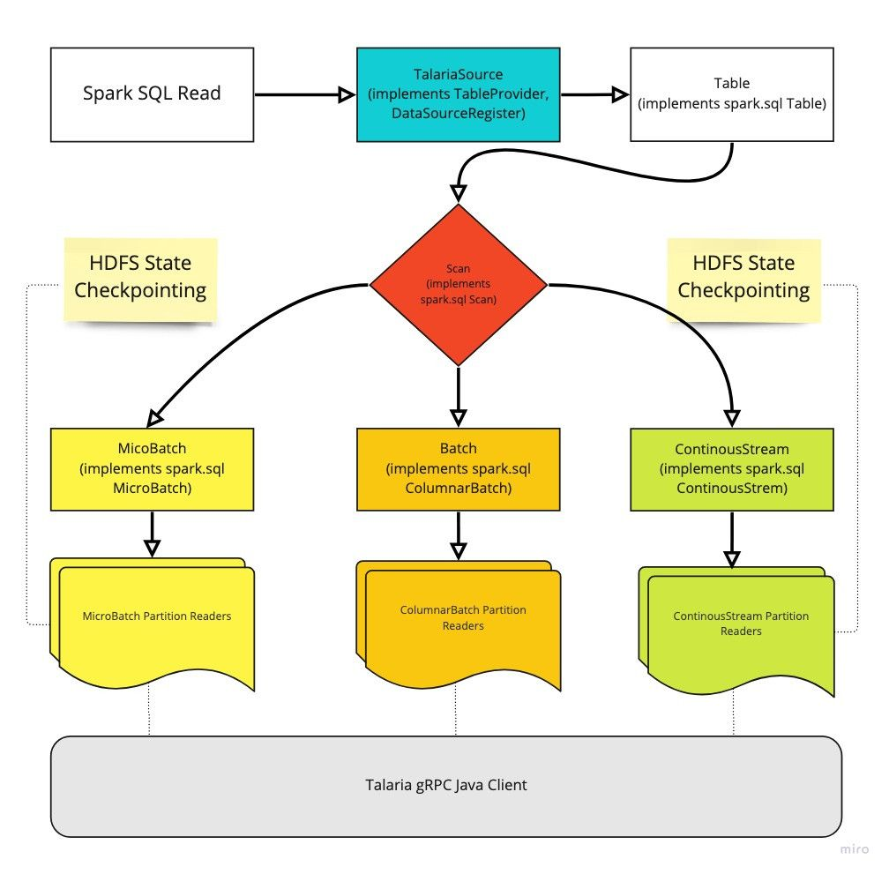

# Implementation Specifics

## Data Storage and Retrieval from Talaria

The incoming batch of events will be stored in badger db as a key value pair, with key being an integer slice composed of BigEndian integer representations
- of partition-key hash from 0-4
- of time epoch value in seconds from 4-12
- of auto increment integer from 12-16 and the value being the ORC encoded columnar format of the batch.

For querying the data, Talaria provides gRPC Service Methods for getting 
- TableMeta → tableName, cols, schema, hashKey, sortKey
- Splits → encoded key ranges on each talaria node.
- Rows → the actual data in each node.

## Anatomy of Apache Spark Connector (DataSource V2 API):

Spark looks up the data sources and the classes associated with it when a read statement is issued. If the source provider class is found
1. It looks into the table provider implementations to determine if the table supports the operation(Batch, MicroBatch, ContinuousStream).
2. It then calls Table Scan implementations to determine the logical plan for execution like number of partitions, tasks per executor e.t.c
3. It calls the appropriate READ implementations to create partitions using a factory pattern.
4. These partition objects are serialised and shipped to executors as SparkTask objects.
5. Workers deserialise the partition objects and invoke partitionReader methods.
6. PartitionReaders contain the actual implementation of fetching data from the underlying Source Provider.
7. After fetching, the data is converted in spark ColumnarBatch of VectorizedColumns for Batch, MicroBatchStream use cases and list of InternalRow s (simply rows) for spark to read the data as RDD.

### Checkpointing:

To handle fault tolerance upon application crashes, the connector maintains checkpoints of the latest offset in HDFS backed state storage system. When the streaming application becomes healthy again, it resumes from the last read checkpoint.

> :information_source: **MicroBatchStream**: Spark MicroBatchStream guarantees exactly once delivery semantics with a latency around ~100milliseconds.

> :warning: **ContinousStream[Experimental]:**: Spark ContinuousStream follows at-least once delivery semantics with a latency around ~1 millisecond.